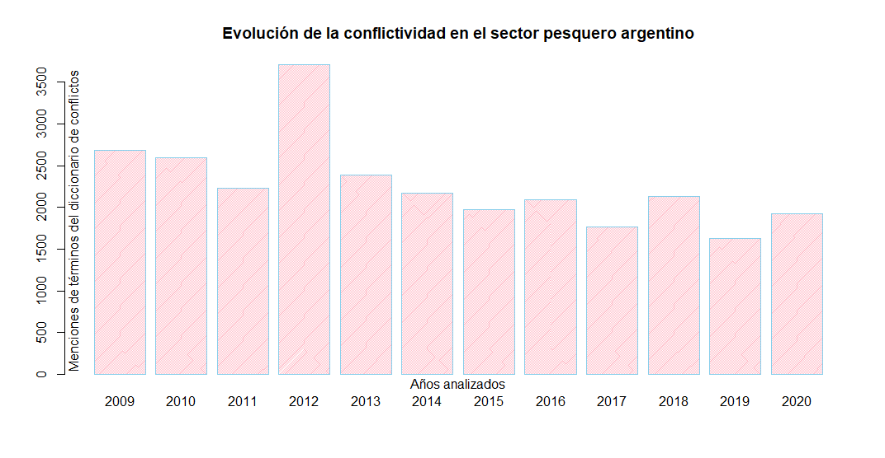
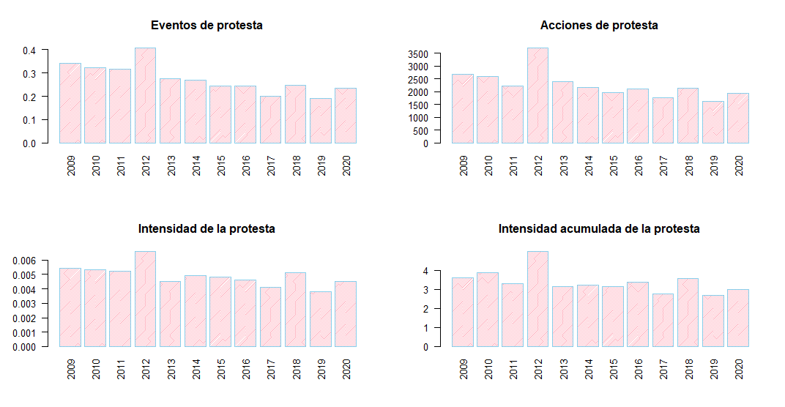

## ACEP: Análisis Computacional de Eventos de Protesta

  <!-- badges: start -->
  [](https://app.codecov.io/gh/agusnieto77/ACEP?branch=master)
  [](https://github.com/agusnieto77/ACEP/actions)
  [](https://doi.org/10.5281/zenodo.6800706)
  [](https://www.repostatus.org/#active)
  [](https://github.com/agusnieto77/ACEP)
  
  [](https://cran.r-project.org/web/licenses/MIT)
  [](https://github.com/agusnieto77/ACEP)
  [](https://lifecycle.r-lib.org/articles/stages.html#stable)
  [](https://github.com/agusnieto77/ACEP)
  [](https://github.com/agusnieto77/ACEP)
  [](https://observatoriodeconflictividad.org/el-pulso-de-la-conflictividad-en-tiempo-real/)
  <!-- badges: end -->

### Visión general

ACEP es un paquete de funciones en lenguaje R útiles para la detección y el análisis de eventos de protesta en corpus de textos periodísticos.

### Instalación de la versión en desarrollo

``` r
# install.packages("devtools")
devtools::install_github("agusnieto77/ACEP")
```

### Funciones

| Nombre | Descripción |
|:---|:------|
|`acep_db()`	|Frecuencia, menciones e intensidad.|
|`acep_frec()`|Frecuencia de palabras totales.|
|`acep_int()`|Índice de intensidad.|
|`acep_load_base()`|Carga bases de datos creadas por el Observatorio.|
|`acep_men()`|Frecuencia de menciones de palabras.|
|`acep_post_rst()`|Resumen visual de la serie temporal de los índices de conflictividad.|
|`acep_post_st()`|Gráfico de barras de la serie temporal de índices de conflictividad.|
|`acep_rst()`|Serie temporal de índices de conflictividad.|

### Colecciones

| Nombre | Descripción |
|:---|:------|
|`acep_bases`|Colección de notas.|
|`acep_diccionarios`|Colección de diccionarios.|

### Corpus

[](https://doi.org/10.5281/zenodo.6800663) Colección de notas del diario ***La Nación***

[](https://doi.org/10.5281/zenodo.6800765) Subset de notas del diario ***La Nación***

[](https://doi.org/10.5281/zenodo.6800617) Colección de notas del ***Ecos Diarios***

[](https://doi.org/10.5281/zenodo.6800637) Colección de notas de la ***Revista Puerto***

[](https://doi.org/10.5281/zenodo.6800650) Colección de notas del diario ***La Nueva***

[](https://doi.org/10.5281/zenodo.6800660) Colección de notas del diario ***La Capital***

### Bases de datos de Eventos de protesta disponibles online

[ACLED](https://acleddata.com/#/dashboard): Armed Conflict Location & Event Data Project.

[GDELT](https://www.gdeltproject.org/): The GDELT Project About. 

[GPT](https://carnegieendowment.org/publications/interactive/protest-tracker#): Global Protest Tracker.

[MMPD](https://dataverse.harvard.edu/dataverse/MMdata): Mass Mobilization Protest Data Project.

[NAVCO](https://dataverse.harvard.edu/dataverse/navco): Nonviolent and Violent Campaigns and Outcomes data project. 

[NVCO](https://nvdatabase.swarthmore.edu/): Global Nonviolent Action Database. 

[SCAD](https://www.strausscenter.org/ccaps-research-areas/social-conflict/database/): Social Conflict Analysis Database.

[SPEED](https://clinecenter.illinois.edu/project/human-loop-event-data-projects/SPEED): The Social, Political and Economic Event Database Project.

[UCDP](https://www.pcr.uu.se/research/ucdp/): Uppsala Conflict Data Program. 

### Bases de datos de interés general

[BM](https://datos.bancomundial.org/): Datos de libre acceso del Banco Mundial.

[DARG](https://www.datos.gob.ar/): Datos abiertos de Argentina.

[MGP](https://datos.mardelplata.gob.ar/): Datos abiertos del Municipio de Gral. Pueyrredon, Buenos Aires, Argentina.

### Uso de las funciones del paquete ACEP: un ejemplo.

``` r
# Cargamos la librería
require(ACEP)

<<<<<<< HEAD
# Cargamos la base de notas de la Revista Puerto con la función acep_load_base()
rev_puerto <- acep_load_base(acep_bases$rp_mdp)
=======
# Cargamos la etiqueta de la base a descargar
rp_mdp <- acep_bases$rp_mdp

# Cargamos la base de notas de la Revista Puerto
revista_puerto <- acep_load_base(rp_mdp)

# Cargamos el diccionario de conflictos de SISMOS
dicc_confl_sismos <- acep_diccionarios$dicc_confl_sismos
>>>>>>> a300cf071ca0e775acb508d9f85f35129129f8de

# Con la función acep_frec() contamos la frecuencia de palabras de cada nota y creamos una
# nueva columna llamada  n_palabras
revista_puerto$n_palabras <- acep_frec(revista_puerto$nota)

# Imprimimos en pantalla la base con la nueva columna de frecuencia de palabras
revista_puerto

# A tibble: 7,816 × 7
   fecha      titulo                           bajada nota  imagen link  n_palabras
   <date>     <chr>                            <chr>  <chr> <chr>  <chr>      <int>
 1 2020-12-29 ¡Feliz Año 2021 para todos nues… Con m… "Con… https… http…         31
 2 2020-12-28 Mapa del trabajo esclavo en agu… Un re… "El … https… http…       1128
 3 2020-12-24 Plantas piden tener garantizada… En Ch… "El … https… http…        530
 4 2020-12-24 Los obreros navales despiden el… En Ma… "El … https… http…        483
 5 2020-12-23 El incumplimiento del régimen d… Se ll… "Las… https… http…        525
 6 2020-12-23 Otro fallo ratifica cautelar co… La Cá… "La … https… http…        462
 7 2020-12-22 Recomendaciones de SENASA para … Desde… "En … https… http…        650
 8 2020-12-22 Trelew consolida su inserción e… En 20… "Ins… https… http…        830
 9 2020-12-21 El CFP presentó el estado y la … En la… "Ant… https… http…       1434
10 2020-12-21 La flota amarilla cierra el año… Puert… "El … https… http…       1056
# … with 7,806 more rows

# Ahora con la función acep_men() contamos la frecuencia de menciones de términos del
# diccionario de conflictividad de SISMOS de cada nota y creamos una nueva columna llamada  conflictos
revista_puerto$conflictos <- acep_men(revista_puerto$nota, dicc_confl_sismos)

# Imprimimos en pantalla la base con la nueva columna de menciones del diccionario de conflictividad
revista_puerto

# A tibble: 7,816 × 8
   fecha      titulo                bajada nota  imagen link  n_palabras conflictos
   <date>     <chr>                 <chr>  <chr> <chr>  <chr>      <int>      <int>
 1 2020-12-29 ¡Feliz Año 2021 para… Con m… "Con… https… http…         31          0
 2 2020-12-28 Mapa del trabajo esc… Un re… "El … https… http…       1128          4
 3 2020-12-24 Plantas piden tener … En Ch… "El … https… http…        530          3
 4 2020-12-24 Los obreros navales … En Ma… "El … https… http…        483          8
 5 2020-12-23 El incumplimiento de… Se ll… "Las… https… http…        525          4
 6 2020-12-23 Otro fallo ratifica … La Cá… "La … https… http…        462          6
 7 2020-12-22 Recomendaciones de S… Desde… "En … https… http…        650          0
 8 2020-12-22 Trelew consolida su … En 20… "Ins… https… http…        830          4
 9 2020-12-21 El CFP presentó el e… En la… "Ant… https… http…       1434          3
10 2020-12-21 La flota amarilla ci… Puert… "El … https… http…       1056          4
# … with 7,806 more rows

# Ahora con la función acep_int() calculamos un índice de intensidad de la conflictividad y creamos una
# nueva columna llamada  intensidad
revista_puerto$intensidad <- acep_int(revista_puerto$conflictos, revista_puerto$n_palabras, 3)

# Imprimimos en pantalla la base con la nueva columna de intensidad
revista_puerto

# A tibble: 7,816 × 9
   fecha      titulo     bajada nota  imagen link  n_palabras conflictos intensidad
   <date>     <chr>      <chr>  <chr> <chr>  <chr>      <int>      <int>      <dbl>
 1 2020-12-29 ¡Feliz Añ… Con m… "Con… https… http…         31          0      0    
 2 2020-12-28 Mapa del … Un re… "El … https… http…       1128          4      0.004
 3 2020-12-24 Plantas p… En Ch… "El … https… http…        530          3      0.006
 4 2020-12-24 Los obrer… En Ma… "El … https… http…        483          8      0.017
 5 2020-12-23 El incump… Se ll… "Las… https… http…        525          4      0.008
 6 2020-12-23 Otro fall… La Cá… "La … https… http…        462          6      0.013
 7 2020-12-22 Recomenda… Desde… "En … https… http…        650          0      0    
 8 2020-12-22 Trelew co… En 20… "Ins… https… http…        830          4      0.005
 9 2020-12-21 El CFP pr… En la… "Ant… https… http…       1434          3      0.002
10 2020-12-21 La flota … Puert… "El … https… http…       1056          4      0.004
# … with 7,806 more rows

# Volvemos a cargar la base de notas de la Revista Puerto sin procesar
revista_puerto <- acep_load_base(rp_mdp)

# Ahora con la función acep_db() aplicamos las tres funciones en un solo paso
rp_procesada <- acep_db(revista_puerto, revista_puerto$nota, dicc_confl_sismos, 3)

# Imprimimos en pantalla la base con las tres columna creadas
rp_procesada

# A tibble: 7,816 × 9
   fecha      titulo     bajada nota  imagen link  n_palabras conflictos intensidad
   <date>     <chr>      <chr>  <chr> <chr>  <chr>      <int>      <int>      <dbl>
 1 2020-12-29 ¡Feliz Añ… Con m… "Con… https… http…         31          0      0    
 2 2020-12-28 Mapa del … Un re… "El … https… http…       1128          4      0.004
 3 2020-12-24 Plantas p… En Ch… "El … https… http…        530          3      0.006
 4 2020-12-24 Los obrer… En Ma… "El … https… http…        483          8      0.017
 5 2020-12-23 El incump… Se ll… "Las… https… http…        525          4      0.008
 6 2020-12-23 Otro fall… La Cá… "La … https… http…        462          6      0.013
 7 2020-12-22 Recomenda… Desde… "En … https… http…        650          0      0    
 8 2020-12-22 Trelew co… En 20… "Ins… https… http…        830          4      0.005
 9 2020-12-21 El CFP pr… En la… "Ant… https… http…       1434          3      0.002
10 2020-12-21 La flota … Puert… "El … https… http…       1056          4      0.004
# … with 7,806 more rows

# Ahora con la función acep_rst() elaboramos un resumen estadístico
rp_procesada <- acep_rst(rp_procesada, rp_procesada$fecha, rp_procesada$n_palabras, 
                         rp_procesada$conflictos, st = 'anio', u = 4)

# Imprimimos en pantalla la base con las tres columna creadas
rp_procesada

# A tibble: 12 × 8
   st    frecn   csn  frecp frecm intac intensidad int_notas_confl
   <chr> <int> <dbl>  <int> <int> <dbl>      <dbl>           <dbl>
 1 2009    632   215 496110  2688  3.61     0.0054           0.340
 2 2010    680   219 492231  2598  3.89     0.0053           0.322
 3 2011    601   189 425747  2234  3.29     0.0052           0.314
 4 2012    739   301 564270  3710  4.99     0.0066           0.407
 5 2013    689   190 525718  2388  3.15     0.0045           0.276
 6 2014    631   170 444823  2175  3.20     0.0049           0.269
 7 2015    620   151 409791  1977  3.12     0.0048           0.244
 8 2016    675   165 454776  2095  3.38     0.0046           0.244
 9 2017    637   128 433212  1765  2.76     0.0041           0.201
10 2018    639   157 422204  2136  3.55     0.0051           0.246
11 2019    637   122 426511  1628  2.69     0.0038           0.192
12 2020    636   150 427276  1926  2.98     0.0045           0.236

# Ahora con la función acep_plot_st() elaboramos un gráfico de barras 
# con menciones del diccionario de conflictividad
acep_plot_st(rp_procesada$st, rp_procesada$frecm,
             t = 'Evolución de la conflictividad en el sector pesquero argentino',
             ejex = 'Años analizados',
             ejey = 'Menciones de términos del diccionario de conflictos',
             etiquetax = 'horizontal')
```


``` r
# Ahora con la función acep_plot_rst() elaboramos una visualización resumen
# con cuatro gráficos de barras 
acep_plot_rst(rp_procesada, tagx = 'vertical')
```

