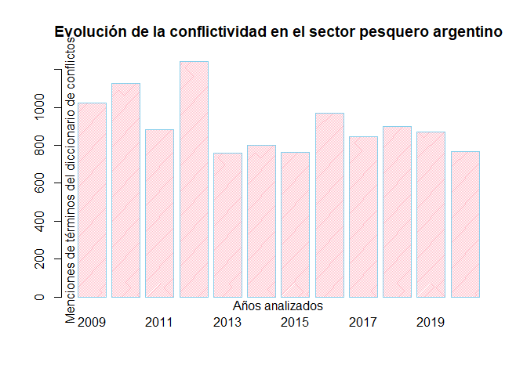
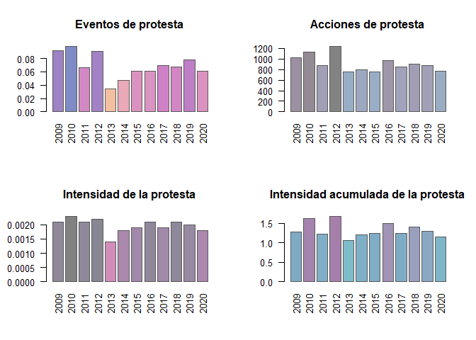

<!-- README.md is generated from README.Rmd. Please edit that file -->

# ACEP: Análisis Computacional de Eventos de Protesta

<!-- badges: start -->

[](https://app.codecov.io/gh/agusnieto77/ACEP?branch=master)
[](https://github.com/agusnieto77/ACEP/actions)
[](https://doi.org/10.5281/zenodo.6800706)
[](https://www.repostatus.org/#active)
[](https://cran.r-project.org/package=ACEP)
[](https://github.com/agusnieto77/ACEP)
[](https://cran.r-project.org/web/licenses/MIT)
[](https://github.com/agusnieto77/ACEP)
[](https://lifecycle.r-lib.org/articles/stages.html#stable)
[](https://github.com/agusnieto77/ACEP)
[](https://github.com/agusnieto77/ACEP)
[](https://observatoriodeconflictividad.org/el-pulso-de-la-conflictividad-en-tiempo-real/)
[](https://cran.r-project.org/package=ACEP)
[](https://cran.r-project.org/package=ACEP)
<!-- badges: end -->

### Vision general

ACEP es un paquete de funciones en lenguaje R útiles para la detección y
el análisis de eventos de protesta en corpus de textos periodísticos.
Sus funciones son aplicables a cualquier corpus de textos. Ademas de las
funciones, ACEP contiene también bases de datos con colecciones de notas
sobre protestas y una colección de diccionarios de palabras conflictivas
y otros tópicos referidos a diferentes aspectos del análisis de eventos
de protesta.

### Instalacion de la version estable

Puedes instalar la versión estable de ACEP desde
[CRAN](https://CRAN.R-project.org/package=ACEP) con:

``` r
install.packages("ACEP")
```

### Instalacion de la version en desarrollo

Puedes instalar la versión de desarrollo de ACEP desde
[GitHub](https://github.com/agusnieto77/ACEP) con:

``` r
# install.packages("devtools")
devtools::install_github("agusnieto77/ACEP")
```

### Funciones

| Nombre               | Ciclo                                                                        | Descripción                                                                       |
|:---------------------|:-----------------------------------------------------------------------------|:----------------------------------------------------------------------------------|
| `acep_clean()`       |    | Limpieza de texto.                                                                |
| `acep_cleaning()`    |  | Limpieza de texto.                                                                |
| `acep_context()`     |  | Función para extraer contexto de palabras o frases.                               |
| `acep_count()`       |        | Frecuencia de menciones de palabras.                                              |
| `acep_db()`          |        | Frecuencia, menciones e intensidad.                                               |
| `acep_detect()`      |        | Detección de menciones de palabras.                                               |
| `acep_extract()`     |  | Extraer palabras de un texto.                                                     |
| `acep_frec()`        |        | Frecuencia de palabras totales.                                                   |
| `acep_gpt()`         |  | Función para interactuar con los modelos de OpenAI.                               |
| `acep_int()`         |        | Índice de intensidad.                                                             |
| `acep_load_base()`   |        | Carga bases de datos creadas por el Observatorio.                                 |
| `acep_may()`         |  | Convierte el texto mayúsculas                                                     |
| `acep_men()`         |    | Frecuencia de menciones de palabras.                                              |
| `acep_min()`         |  | Convierte el texto minúsculas.                                                    |
| `acep_plot_rst()`    |        | Resumen visual de la serie temporal de los índices de conflictividad.             |
| `acep_plot_st()`     |        | Gráfico de barras de la serie temporal de índices de conflictividad.              |
| `acep_postag()`      |  | Función para etiquetado POS, lematización, tokenización, extracción de entidades. |
| `acep_rst()`         |    | Serie temporal de índices de conflictividad.                                      |
| `acep_sst()`         |        | Serie temporal de índices de conflictividad.                                      |
| `acep_svo()`         |  | Función para extraer tripletes SVO (Sujeto-Verbo-Objeto).                         |
| `acep_token()`       |  | Función para tokenizar.                                                           |
| `acep_token_plot()`  |  | Gráfico de barras de palabras más recurrentes en un corpus.                       |
| `acep_token_table()` |  | Tabla de frecuencia de palabras tokenizadas.                                      |

### Colecciones

| Nombre              | Descripción                                             |
|:--------------------|:--------------------------------------------------------|
| `acep_bases`        | Colección de notas.                                     |
| `acep_diccionarios` | Colección de diccionarios.                              |
| `acep_prompt_gpt`   | Colección de instrucciones.                             |
| `acep_rs`           | Cadenas de caracteres para limpiar y normalizar textos. |

### Corpus

[](https://doi.org/10.5281/zenodo.6800663)
Colección de notas del diario ***La Nación***

[](https://doi.org/10.5281/zenodo.6800765)
Subset de notas del diario ***La Nación***

[](https://doi.org/10.5281/zenodo.6800617)
Colección de notas del ***Ecos Diarios***

[](https://doi.org/10.5281/zenodo.6800637)
Colección de notas de la ***Revista Puerto***

[](https://doi.org/10.5281/zenodo.6800650)
Colección de notas del diario ***La Nueva***

[](https://doi.org/10.5281/zenodo.6800660)
Colección de notas del diario ***La Capital***

### Bases de datos de Eventos de protesta disponibles online

[ACLED](https://acleddata.com/#/dashboard): Armed Conflict Location &
Event Data Project.

[GDELT](https://www.gdeltproject.org/): The GDELT Project About.

[GPT](https://carnegieendowment.org/publications/interactive/protest-tracker#):
Global Protest Tracker.

[MMPD](https://dataverse.harvard.edu/dataverse/MMdata): Mass
Mobilization Protest Data Project.

[NAVCO](https://dataverse.harvard.edu/dataverse/navco): Nonviolent and
Violent Campaigns and Outcomes data project.

[NVCO](https://nvdatabase.swarthmore.edu/): Global Nonviolent Action
Database.

[SCAD](https://www.strausscenter.org/ccaps-research-areas/social-conflict/database/):
Social Conflict Analysis Database.

[SPEED](https://clinecenter.illinois.edu/project/human-loop-event-data-projects/SPEED):
The Social, Political and Economic Event Database Project.

[UCDP](https://www.pcr.uu.se/research/ucdp/): Uppsala Conflict Data
Program.

### Bases de datos de interes general

[FMI](https://data.imf.org/?sk=388dfa60-1d26-4ade-b505-a05a558d9a42):
FMI Data.

[BM](https://datos.bancomundial.org/): Datos de libre acceso del Banco
Mundial.

[OIT](https://www.ilo.org/global/statistics-and-databases/lang--es/index.htm):
Estadísticas y bases de datos.

[CEPAL](https://www.cepal.org/es/datos-y-estadisticas): Datos y
estadísticas.

[DARG](https://www.datos.gob.ar/): Datos abiertos de Argentina.

[MGP](https://datos.mardelplata.gob.ar/): Datos abiertos del Municipio
de Gral. Pueyrredon, Buenos Aires, Argentina.

### Uso de las funciones del paquete ACEP: un ejemplo.

``` r

# Cargamos la librería
require(ACEP)
#> Loading required package: ACEP

# Cargamos la base de notas de la Revista Puerto con la función acep_load_base()
rev_puerto <- acep_load_base(acep_bases$rp_mdp)
#> Descargando...

# Cargamos la etiqueta de la base a descargar
rp_mdp <- acep_bases$rp_mdp

# Cargamos la base de notas de la Revista Puerto
revista_puerto <- acep_load_base(rp_mdp)
#> Descargando...

# Cargamos el diccionario de conflictos de SISMOS
dicc_confl_sismos <- acep_diccionarios$dicc_confl_sismos

# Con la función acep_frec() contamos la frecuencia de palabras de cada nota
# y creamos una nueva columna llamada  n_palabras
revista_puerto$n_palabras <- acep_frec(revista_puerto$nota)

# Imprimimos en pantalla la base con la nueva columna de frecuencia de palabras
head(revista_puerto)
#> # A tibble: 6 × 7
#>   fecha      titulo                         bajada nota  imagen link  n_palabras
#>   <date>     <chr>                          <chr>  <chr> <chr>  <chr>      <int>
#> 1 2020-12-29 ¡Feliz Año 2021 para todos nu… Con m… "Con… https… http…         31
#> 2 2020-12-28 Mapa del trabajo esclavo en a… Un re… "El … https… http…       1128
#> 3 2020-12-24 Plantas piden tener garantiza… En Ch… "El … https… http…        530
#> 4 2020-12-24 Los obreros navales despiden … En Ma… "El … https… http…        483
#> 5 2020-12-23 El incumplimiento del régimen… Se ll… "Las… https… http…        525
#> 6 2020-12-23 Otro fallo ratifica cautelar … La Cá… "La … https… http…        462

# Ahora con la función acep_men() contamos la frecuencia de menciones de
# términos del diccionario de conflictividad de SISMOS de cada nota y
# creamos una nueva columna llamada  conflictos.
# Elaboramos un corpus acotado para el ejemplo
revista_puerto <- revista_puerto[1:100, ]
revista_puerto$conflictos <- acep_count(revista_puerto$nota, dicc_confl_sismos)

# Imprimimos en pantalla la base con la nueva columna de
# menciones del diccionario de conflictividad
head(revista_puerto)
#> # A tibble: 6 × 8
#>   fecha      titulo              bajada nota  imagen link  n_palabras conflictos
#>   <date>     <chr>               <chr>  <chr> <chr>  <chr>      <int>      <dbl>
#> 1 2020-12-29 ¡Feliz Año 2021 pa… Con m… "Con… https… http…         31          0
#> 2 2020-12-28 Mapa del trabajo e… Un re… "El … https… http…       1128          0
#> 3 2020-12-24 Plantas piden tene… En Ch… "El … https… http…        530          0
#> 4 2020-12-24 Los obreros navale… En Ma… "El … https… http…        483          0
#> 5 2020-12-23 El incumplimiento … Se ll… "Las… https… http…        525          0
#> 6 2020-12-23 Otro fallo ratific… La Cá… "La … https… http…        462          0

# Ahora con la función acep_int() calculamos un índice de intensidad de
# la conflictividad y creamos una nueva columna llamada  intensidad
revista_puerto$intensidad <- acep_int(
  revista_puerto$conflictos,
  revista_puerto$n_palabras,
  3)

# Imprimimos en pantalla la base con la nueva columna de intensidad
head(revista_puerto)
#> # A tibble: 6 × 9
#>   fecha      titulo   bajada nota  imagen link  n_palabras conflictos intensidad
#>   <date>     <chr>    <chr>  <chr> <chr>  <chr>      <int>      <dbl>      <dbl>
#> 1 2020-12-29 ¡Feliz … Con m… "Con… https… http…         31          0          0
#> 2 2020-12-28 Mapa de… Un re… "El … https… http…       1128          0          0
#> 3 2020-12-24 Plantas… En Ch… "El … https… http…        530          0          0
#> 4 2020-12-24 Los obr… En Ma… "El … https… http…        483          0          0
#> 5 2020-12-23 El incu… Se ll… "Las… https… http…        525          0          0
#> 6 2020-12-23 Otro fa… La Cá… "La … https… http…        462          0          0
```

``` r
# Volvemos a cargar la base de notas de la Revista Puerto sin procesar
revista_puerto <- acep_load_base(rp_mdp)
#> Descargando...

# Creamos un subset
subset_rp <- revista_puerto[1:100, ]

# Cargamos el diccionario de conflictos de SISMOS
dicc_confl_sismos <- acep_diccionarios$dicc_confl_sismos

# Ahora con la función acep_db() aplicamos las tres funciones en un solo paso
rp_procesada <- acep_db(subset_rp, subset_rp$nota, dicc_confl_sismos, 3)

# Imprimimos en pantalla la base con las tres columna creadas
head(rp_procesada)
#> # A tibble: 6 × 9
#>   fecha      titulo   bajada nota  imagen link  n_palabras conflictos intensidad
#>   <date>     <chr>    <chr>  <chr> <chr>  <chr>      <int>      <dbl>      <dbl>
#> 1 2020-12-29 ¡Feliz … Con m… "Con… https… http…         31          0          0
#> 2 2020-12-28 Mapa de… Un re… "El … https… http…       1128          0          0
#> 3 2020-12-24 Plantas… En Ch… "El … https… http…        530          0          0
#> 4 2020-12-24 Los obr… En Ma… "El … https… http…        483          0          0
#> 5 2020-12-23 El incu… Se ll… "Las… https… http…        525          0          0
#> 6 2020-12-23 Otro fa… La Cá… "La … https… http…        462          0          0
```

``` r
# Cargamos los datos procesados
rp_procesada <- acep_bases$rp_procesada

# Ahora con la función acep_rst() elaboramos un resumen estadístico
rp_procesada <- acep_sst(rp_procesada, st = "anio", u = 4)

# Imprimimos en pantalla la base con las métricas de conflictividad
head(rp_procesada)
#>     st frecn csn  frecp frecm  intac intensidad int_notas_confl
#> 1 2009   632  58 496110  1025 1.2735     0.0021          0.0918
#> 2 2010   680  67 492231  1129 1.6273     0.0023          0.0985
#> 3 2011   601  40 425747   882 1.2204     0.0021          0.0666
#> 4 2012   739  67 564270  1242 1.6841     0.0022          0.0907
#> 5 2013   689  24 525718   758 1.0559     0.0014          0.0348
#> 6 2014   631  30 444823   802 1.2112     0.0018          0.0475

# Ahora con la función acep_plot_st() elaboramos un gráfico de barras
# con menciones del diccionario de conflictividad
acep_plot_st(rp_procesada$st, rp_procesada$frecm,
 t = "Evolucion de la conflictividad en el sector pesquero argentino",
 ejex = "A\u00f1os analizados",
 ejey = "Menciones del diccionario de conflictos",
 etiquetax = "horizontal")
```



``` r

# Ahora con la función acep_plot_rst() elaboramos una visualización resumen.
# con cuatro gráficos de barras
acep_plot_rst(rp_procesada, tagx = "vertical")
```


