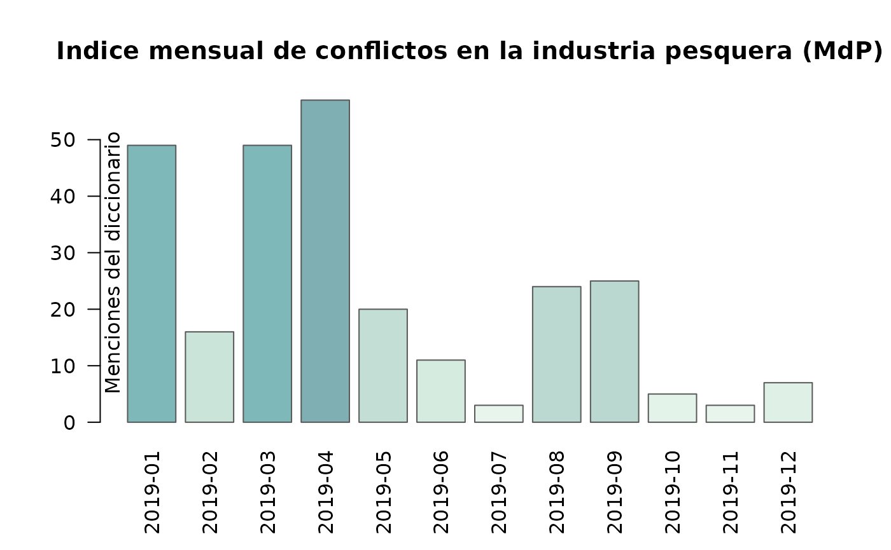
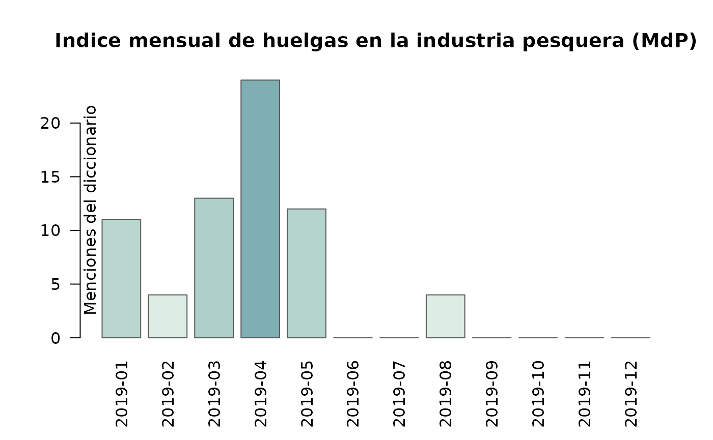

# Conflictividad laboral en la pesca

## Introducción

En este artículo desarrollaremos una introducción al análisis de la
conflictividad laboral en la industria pesquera argentina con un enfoque
de diccionario en base a las funciones del paquete ACEP. En esta
oportunidad pondremos el foco en la conflictividad laboral protagonizada
por el Sindicato Obrero de la Industria del Pescado (SOIP) en la ciudad
de Mar del Plata entre los años 2009 y 2020.

## El corpus de notas

Para que este artículo pueda reconstruirse en CRAN sin depender de
descargas externas, los ejemplos ejecutables usan
`ACEP::acep_bases$lc_720`, una muestra incluida en el paquete. Se
compone de 720 notas y 9 variables: id, fecha, seccion, titulo, bajada,
nota, nota_norm, link, clas_hum. En una sesión interactiva con conexión
también se puede cargar el corpus completo de Revista Puerto con
`acep_load_base(acep_bases$rp_mdp)`.

``` r

# Cargamos la librería ACEP
library(ACEP)

# Cargamos una muestra incluida en el paquete
rev_puerto <- acep_bases$lc_720

# Imprimimos la base en consola
rev_puerto
```

    #> # A tibble: 720 × 9
    #>       id fecha      seccion   titulo       bajada nota  nota_norm link  clas_hum
    #>    <dbl> <date>     <fct>     <chr>        <chr>  <chr> <chr>     <chr> <lgl>   
    #>  1     1 2016-03-01 La Ciudad Emotivo: po… "Hace… "Los… "los dos… http… FALSE   
    #>  2     2 2016-03-01 La Ciudad El oficiali… "En l… "La … "la decl… http… TRUE    
    #>  3     3 2016-03-02 La Ciudad Rech tambié… "El r… "El … "el conc… http… TRUE    
    #>  4     4 2016-03-02 La Ciudad Anuncian in… "El i… "El … "el inte… http… FALSE   
    #>  5     5 2016-03-02 La Ciudad Video: la p… "El C… "De … "de mane… http… FALSE   
    #>  6     6 2016-03-03 La Ciudad Nuevas inve… "Una … "Rep… "represe… http… FALSE   
    #>  7     7 2016-03-03 La Ciudad Exigimos un… "Para… "En … "en el m… http… TRUE    
    #>  8     8 2016-03-03 La Ciudad Hoy en Mar … "Clas… "Yog… "yoga y … http… TRUE    
    #>  9     9 2016-03-06 La Ciudad El Colegio … "Será… "El … "el cons… http… FALSE   
    #> 10    10 2016-03-06 La Ciudad La inseguri… "A pe… "Un … "un grup… http… TRUE    
    #> # ℹ 710 more rows

## Los diccionarios

Una vez cargada la base de notas vamos a crear variables numéricas que
contengan las frecuencias de palabras totales y de cada diccionario
usado para cada una de las notas. En esta parte del código haremos uso
de dos funciones del paquete ACEP:
[`acep_frec()`](https://agusnieto77.github.io/ACEP/reference/acep_frec.md)
y
[`acep_count()`](https://agusnieto77.github.io/ACEP/reference/acep_count.md).
También crearemos diccionarios breves para identificar menciones a
conflictos, huelgas y actores colectivos.

``` r

# Creamos la variable con la frecuencia de palabras por nota
rev_puerto$frec_palabras <- acep_frec(rev_puerto$nota)

# Creamos el diccionario de palabras que refieren a huelgas
dicc_huelgas <- c("en paro", "al paro", "huelga", "huelguistas", "paro y movil",
                  "paro de actividades", "conciliación obligatoria", "un paro", 
                  "paro total", "paro parcial", "trabajo a reglamento", 
                  "el paro", "de brazos caídos")

# Cargamos el diccionario de palabras que refieren a conflictividad
dicc_conflictos_base <- c("conflicto", "conflictos", "protesta", "protestas",
                          "reclamo", "reclamos", "paro", "huelga",
                          "movilización", "manifestación")
dicc_conflictos <- unique(c(dicc_conflictos_base, dicc_huelgas))

# Creamos la variable con la frecuencia de palabras que refieren a conflictividad
rev_puerto$frec_conflictos <- acep_count(rev_puerto$nota, dicc_conflictos)

# Creamos la variable con la frecuencia de palabras que refieren a huelgas
rev_puerto$frec_huelgas <- acep_count(rev_puerto$nota, dicc_huelgas)

# Creamos el diccionario de palabras que refieren a actores colectivos
dicc_actores <- c("trabajadores", "docentes", "sindicato", "vecinos",
                  "municipal", "gobierno")

# Creamos la variable con la frecuencia de palabras que 
# refieren a actores colectivos
rev_puerto$frec_actores <- acep_count(rev_puerto$nota, dicc_actores)

# Imprimimos la base en consola
rev_puerto
```

    #> # A tibble: 720 × 13
    #>       id fecha      seccion   titulo       bajada nota  nota_norm link  clas_hum
    #>    <dbl> <date>     <fct>     <chr>        <chr>  <chr> <chr>     <chr> <lgl>   
    #>  1     1 2016-03-01 La Ciudad Emotivo: po… "Hace… "Los… "los dos… http… FALSE   
    #>  2     2 2016-03-01 La Ciudad El oficiali… "En l… "La … "la decl… http… TRUE    
    #>  3     3 2016-03-02 La Ciudad Rech tambié… "El r… "El … "el conc… http… TRUE    
    #>  4     4 2016-03-02 La Ciudad Anuncian in… "El i… "El … "el inte… http… FALSE   
    #>  5     5 2016-03-02 La Ciudad Video: la p… "El C… "De … "de mane… http… FALSE   
    #>  6     6 2016-03-03 La Ciudad Nuevas inve… "Una … "Rep… "represe… http… FALSE   
    #>  7     7 2016-03-03 La Ciudad Exigimos un… "Para… "En … "en el m… http… TRUE    
    #>  8     8 2016-03-03 La Ciudad Hoy en Mar … "Clas… "Yog… "yoga y … http… TRUE    
    #>  9     9 2016-03-06 La Ciudad El Colegio … "Será… "El … "el cons… http… FALSE   
    #> 10    10 2016-03-06 La Ciudad La inseguri… "A pe… "Un … "un grup… http… TRUE    
    #> # ℹ 710 more rows
    #> # ℹ 4 more variables: frec_palabras <int>, frec_conflictos <int>,
    #> #   frec_huelgas <int>, frec_actores <int>

## Los índices

Ya construidas las variables de frecuencia de palabras y menciones nos
ocuparemos de elaborar nuevas variables con índices de intensidad en
base al ratio entre las frecuencias de palabras totales y las menciones
de los diccionarios sobre trabajadorxs del pescado, conflictos y
huelgas. Para la elaboración de estos índices haremos uso de la función
[`acep_int()`](https://agusnieto77.github.io/ACEP/reference/acep_int.md)
del paquete ACEP.

``` r

# Creamos la variable con el índice de conflictividad general
rev_puerto$i_conf_gral <- acep_int(rev_puerto$frec_conflictos, 
                                   rev_puerto$frec_palabras)

# Creamos la variable con el índice de incidencia 
# de actores colectivos
rev_puerto$i_actores <- acep_int(rev_puerto$frec_actores,
                                 rev_puerto$frec_palabras)

# Creamos la variable con el índice de huelgas
rev_puerto$i_huelgas <- acep_int(rev_puerto$frec_huelgas, 
                                 rev_puerto$frec_conflictos)

# Filtramos para quedarnos con los índices mayores a 0 
# en la variable del índice de conflictividad general
rev_puerto <- rev_puerto[rev_puerto$i_conf_gral > 0, ]

# Filtramos para quedarnos con los índices mayores a 0
# en el índice de incidencia de actores colectivos
rev_puerto <- rev_puerto[rev_puerto$i_actores > 0, ]

# Imprimimos la base en consola
rev_puerto
```

    #> # A tibble: 244 × 16
    #>       id fecha      seccion   titulo       bajada nota  nota_norm link  clas_hum
    #>    <dbl> <date>     <fct>     <chr>        <chr>  <chr> <chr>     <chr> <lgl>   
    #>  1     7 2016-03-03 La Ciudad Exigimos un… "Para… "En … "en el m… http… TRUE    
    #>  2    10 2016-03-06 La Ciudad La inseguri… "A pe… "Un … "un grup… http… TRUE    
    #>  3    16 2016-03-17 La Ciudad Cirone: Des… "El t… "El … "el titu… http… TRUE    
    #>  4    22 2016-03-22 La Ciudad Arroyo al g… "Por … "Al … "al prin… http… TRUE    
    #>  5    24 2016-03-24 La Ciudad Fueron plan… "En e… "En … "en el p… http… TRUE    
    #>  6    30 2016-04-02 La Ciudad Vecinalista… "Los … "Vec… "vecinal… http… TRUE    
    #>  7    37 2016-04-15 La Ciudad Se hace sen… "Es e… "Los… "los doc… http… TRUE    
    #>  8    41 2016-04-20 La Ciudad Denuncian q… "Lo h… "La … "la pres… http… FALSE   
    #>  9    43 2016-04-20 La Ciudad Frente Reno… "El p… "El … "el bloq… http… TRUE    
    #> 10    51 2016-05-02 La Ciudad Denuncian q… "Aseg… "Los… "los tra… http… TRUE    
    #> # ℹ 234 more rows
    #> # ℹ 7 more variables: frec_palabras <int>, frec_conflictos <int>,
    #> #   frec_huelgas <int>, frec_actores <int>, i_conf_gral <dbl>, i_actores <dbl>,
    #> #   i_huelgas <dbl>

Al realizar los filtros la base se redujo a 244 notas que presentan al
menos una mención de una palabra que refiere a conflicto y al menos un
término que refiere a actores colectivos.

## Serie temporal de índices

En esta parte del código usaremos la función
[`acep_sst()`](https://agusnieto77.github.io/ACEP/reference/acep_sst.md)
para calcular los índices agrupados por año y mes. Primero construimos
la serie de tiempo para la conflictividad general.

``` r

# Calculamos el índice anual de conflictividad general en el
# ámbito de la industrial del procesado de pescado en tierra
# Pero primero preparamos el marcos de datos para ser procesado 
# por la función acep_sst()
# Estos pasos previos se deben realizar porque en este ejemplo no hicimos uso 
# de la función acep_db() que calcula frecuencia, menciones e intensidad y
# deja el marco de datos resultante en un formato adecuado para ser usado
# con la función acep_sst()
datos <- data.frame(
  fecha = rev_puerto$fecha,
  n_palabras = rev_puerto$frec_palabras,
  conflictos = rev_puerto$frec_conflictos,
  intensidad = rev_puerto$i_conf_gral
)

# Luego construimos los vectores
fecha <- datos$fecha
n_palabras <- datos$n_palabras
conflictos <- datos$conflictos

# Ahora agrupamos por mes la conflictividad general del sector
conf_gral_anio <- acep_sst(datos, st = "anio")

# Imprimimos la base en consola
conf_gral_anio |> head()
```

    #>     st frecn csn frecp frecm  intac intensidad int_notas_confl
    #> 1 2016    60  25 36083   168 0.4820     0.0047          0.4167
    #> 2 2017    59  27 43511   210 0.4032     0.0048          0.4576
    #> 3 2018    54  22 29270   170 0.4341     0.0058          0.4074
    #> 4 2019    70  40 49513   269 0.5684     0.0054          0.5714

``` r

# Calculamos el índice mensual de conflictividad general en el
# ámbito de la industrial del procesado de pescado en tierra
# Pero primero preparamos el marcos de datos para ser procesado 
# por la función acep_sst()
datos <- data.frame(
  fecha = rev_puerto$fecha,
  n_palabras = rev_puerto$frec_palabras,
  conflictos = rev_puerto$frec_conflictos,
  intensidad = rev_puerto$i_conf_gral
)

# Nos quedamos con un año presente en la muestra incluida
anio_ejemplo <- names(sort(table(format(as.Date(datos$fecha), "%Y")),
                           decreasing = TRUE))[1]
datos <- datos[format(as.Date(datos$fecha), "%Y") == anio_ejemplo, ]

# Luego construimos los vectores
fecha <- datos$fecha
n_palabras <- datos$n_palabras
conflictos <- datos$conflictos

# Ahora agrupamos por mes la conflictividad general del sector
conf_gral <- acep_sst(datos)

# Imprimimos la base en consola
conf_gral |> head()
```

    #>        st frecn csn frecp frecm  intac intensidad int_notas_confl
    #> 1 2019-01    10   7  9450    49 0.0750     0.0052          0.7000
    #> 2 2019-02     5   3  2075    16 0.0410     0.0077          0.6000
    #> 3 2019-03    12   9  8091    49 0.1249     0.0061          0.7500
    #> 4 2019-04     7   6  5009    57 0.0812     0.0114          0.8571
    #> 5 2019-05     7   3  3818    20 0.0522     0.0052          0.4286
    #> 6 2019-06     5   2  2248    11 0.0340     0.0049          0.4000

En la siguiente parte del código construimos la serie de tiempo para la
conflictividad huelguística.

``` r

# Calculamos el índice mensual de conflictividad huelguística en el
# ámbito de la industrial del procesado de pescado en tierra
# Pero primero preparamos el marcos de datos para ser procesado 
# por la función acep_sst()
datosh <- data.frame(
  fecha = rev_puerto$fecha,
  n_palabras = rev_puerto$frec_palabras,
  conflictos = rev_puerto$frec_huelgas,
  intensidad = rev_puerto$i_huelgas
)

# Nos quedamos con el mismo año de ejemplo
datosh <- datosh[format(as.Date(datosh$fecha), "%Y") == anio_ejemplo, ]

# Luego construimos los vectores
fechah <- datosh$fecha
n_palabrash <- datosh$n_palabras
conflictosh <- datosh$conflictos

# Ahora agrupamos por mes la conflictividad huelguística del sector
huelgas <- acep_sst(datosh)

# Imprimimos la base en consola
huelgas |> head()
```

    #>        st frecn csn frecp frecm  intac intensidad int_notas_confl
    #> 1 2019-01    10   1  9450    11 2.2309     0.0012          0.1000
    #> 2 2019-02     5   1  2075     4 0.7500     0.0019          0.2000
    #> 3 2019-03    12   2  8091    13 2.1179     0.0016          0.1667
    #> 4 2019-04     7   2  5009    24 2.6191     0.0048          0.2857
    #> 5 2019-05     7   3  3818    12 3.7667     0.0031          0.4286
    #> 6 2019-06     5   0  2248     0 0.0000     0.0000          0.0000

## Las visualizaciones

En este último apartado haremos uso de las funciones
[`acep_plot_st()`](https://agusnieto77.github.io/ACEP/reference/acep_plot_st.md)
y
[`acep_plot_rst()`](https://agusnieto77.github.io/ACEP/reference/acep_plot_rst.md)
para visualizar la variación anual y mensual de la conflictividad
general en la muestra incluida en el paquete.

``` r

# Visualizaremos el índice de conflictividad general 
# agrupado por año para el período 2009-2020
acep_plot_st(
 conf_gral_anio$st,
 conf_gral_anio$frecm,
 t = "Indice anual de conflictividad en la industria pesquera (MdP)",
 ejey = "Menciones del diccionario",
 etiquetax = "vertical"
             )
```


    # Visualizaremos el índice de conflictividad general 
    # agrupado por año para el período 2009-2020
    acep_plot_rst(conf_gral_anio, tagx = "vertical")


``` r

# Visualizaremos el índice de conflictividad general 
# agrupado por mes para el 2012
acep_plot_st(
 conf_gral$st,
 conf_gral$frecm,
 t = "Indice mensual de conflictos en la industria pesquera (MdP)",
 ejey = "Menciones del diccionario",
 etiquetax = "vertical"
             )
```



``` r

# Visualizaremos el índice de conflictividad huelguística 
# agrupado por mes para el 2012
acep_plot_st(
 huelgas$st,
 huelgas$frecm,
 t = "Indice mensual de huelgas en la industria pesquera (MdP)",
 ejey = "Menciones del diccionario",
 etiquetax = "vertical"
             )
```



Las distintas métricas permiten explorar la temporalidad de las
menciones a conflictividad en el corpus de ejemplo sin depender de
recursos externos durante la reconstrucción de la vignette.

## Comentarios finales

A lo largo de este breve tutorial sobre algunas de las funciones del
paquete ACEP buscamos ejemplificar de qué modo se puede adoptar un
enfoque de diccionario para realizar un primer análisis exploratorio de
un corpus de notas periodísticas. Los resultados son alentadores. Con la
combinación de distintos diccionarios se pudo identificar la
temporalidad de la conflictividad protagonizada por lxs obrerxs del
pescado en la ciudad de Mar del Plata. En próximos artículos avanzaremos
con otras funciones del paquete ACEP para el análisis computacional de
la conflictividad en la industria pesquera argentina.
