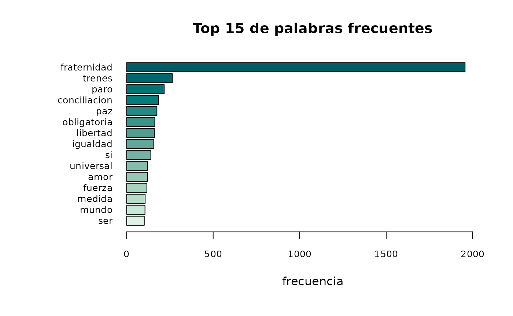

# Tokenizar con ACEP

## Funciones a presentar:

En este artículo se explicarán los procesos que realizan las funciones:

- [`acep_token()`](https://agusnieto77.github.io/ACEP/reference/acep_token.md)

- [`acep_token_table()`](https://agusnieto77.github.io/ACEP/reference/acep_token_table.md)

- [`acep_token_plot()`](https://agusnieto77.github.io/ACEP/reference/acep_token_plot.md)

## Función `acep_token()`

En primer lugar cargamos la librería *ACEP*. Luego, cargamos una base de
tweets para su prueba.

``` r
library(ACEP)

url <- "https://github.com/HDyCSC/datos/raw/main/la_fraternidad.rds"

base <- subset(acep_load_base(url), select = text)$text
```

Ejecutamos la función
[`acep_token()`](https://agusnieto77.github.io/ACEP/reference/acep_token.md)
para los primeros dos elementos de la base.

¿Cuál es el resultado?

La función `acep_token` toma el vector y realiza diferentes acciones:

- Verifica que el objeto entregado sea un vector (de lo contrario indica
  un mensaje de advertencia)

- Cambia todo el texto a minúsculas

- Crea un nuevo data frame con la siguiente información:

  - texto_id (columna que numera el documento)

  - tokens (el token propiamente)

Cabe mencionar que los tokens quedarán identificados a través de los
espacios en blanco, es decir, cada palabra es un token.

``` r
tweets <- acep_token(base[1:2])

head(tweets)
```

    #>   texto_id       tokens
    #> 1        1      googlea
    #> 2        1  fraternidad
    #> 3        2     protesta
    #> 4        2  fraternidad
    #> 5        2       desoye
    #> 6        2 conciliacion

En este resultado podemos ver cómo la función identifica a cada
observación como un documento aparte (en este caso, cada tweet es un
documento identificado en la columna ‘texto_id’). Por su parte, la
columna ‘tokens’ es la columna en la que la función aísla cada token.

## Función `acep_token_table()`

Una vez que tenemos el data frame creado a partir de la función
[`acep_token()`](https://agusnieto77.github.io/ACEP/reference/acep_token.md),
podemos utilizar la `función acep_table()` para obtener un nuevo data
frame que nos proveerá la siguiente información:

- token

- frec (frecuencia que aparece ese token)

- prop (el peso que tiene ese token en el total del corpus)

Para obtener una tabla que tenga sentido, podemos utilizar en primer
lugar la función
[`acep_clean()`](https://agusnieto77.github.io/ACEP/reference/acep_clean.md)
para deshacernos de los stopwords, urls, menciones, hashtags, etc.

``` r
base_limpia <- acep_clean(base)
```

En segunda instancia, creamos un nuevo objeto derivado de la base limpia
con
[`acep_token()`](https://agusnieto77.github.io/ACEP/reference/acep_token.md)
que nos devuelve, como vimos previamente, una tabla con la información
de cada token.

``` r
tabla_tokenizada <- acep_token(base_limpia)
head(tabla_tokenizada)
```

    #>   texto_id       tokens
    #> 1        1      googlea
    #> 2        1  fraternidad
    #> 3        2     protesta
    #> 4        2  fraternidad
    #> 5        2       desoye
    #> 6        2 conciliacion

Por último, aplicamos la función
[`acep_token_table()`](https://agusnieto77.github.io/ACEP/reference/acep_token_table.md)
a la columna ‘tokens’.

Por defecto,
[`acep_token_table()`](https://agusnieto77.github.io/ACEP/reference/acep_token_table.md)
nos devuelve los 10 primeros registros, es decir, las 10 palabras con
mayor frecuencia.

Si quisiéramos modificar la cantidad de palabras, debemos modificar el
parámetro ‘u’ =

Suponiendo que queremos obtener los 20 token de mayor frecuencia:
`acep_token_table(tabla_tokenizada$token, u = 20)`

``` r
acep_token_table(tabla_tokenizada$tokens, u = 15)
```

    #>           token frec       prop
    #> 1   fraternidad 1956 0.47847358
    #> 2        trenes  264 0.06457926
    #> 3          paro  217 0.05308219
    #> 4  conciliacion  184 0.04500978
    #> 5           paz  175 0.04280822
    #> 6   obligatoria  163 0.03987280
    #> 7      libertad  160 0.03913894
    #> 8      igualdad  157 0.03840509
    #> 9            si  140 0.03424658
    #> 10         amor  120 0.02935421
    #> 11    universal  120 0.02935421
    #> 12       fuerza  117 0.02862035
    #> 13       medida  107 0.02617417
    #> 14        mundo  106 0.02592955
    #> 15          ser  102 0.02495108

## Función `acep_token_plot()`

Esta función permite visualizar en un gráfico de barras, los tokens más
frecuentes.

A partir del resultado de
[`acep_token()`](https://agusnieto77.github.io/ACEP/reference/acep_token.md),
podemos obtener el gráfico con los tokens más frecuentes.

Por defecto, el resultado serán los 10 tokens más frecuentes, sin
embargo, a través del parámetro “u =” podemos modificar la cantidad de
tokens a visualizar.

En este ejemplo, tomamos la tabla tokenizada y le indicamos la columna
“token” a visualizar.

``` r
acep_token_plot(tabla_tokenizada$tokens, u = 15)
```


