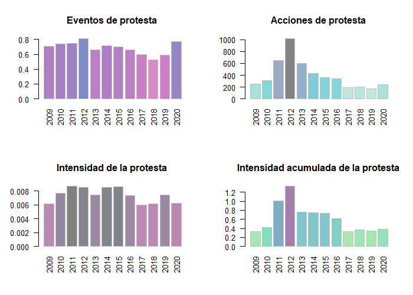

  
```{r, include = FALSE}
knitr::opts_chunk$set(
  collapse = FALSE,
  comment = "#>"
)
```

## Introducción

En este artículo desarrollaremos una introducción al análisis de la conflictividad laboral en la industria pesquera argentina con un enfoque de diccionario en base a las funciones del paquete ACEP. En esta oportunidad pondremos el foco en la conflictividad laboral protagonizada por el Sindicato Obrero de la Industria del Pescado (SOIP) en la ciudad de Mar del Plata entre los años 2009 y 2020.

## El corpus de notas

Las notas que componen el corpus utilizado en este ejercicio fueron raspadas del sitio  [revistapuerto.com.ar](https://revistapuerto.com.ar) con las funciones del paquete `rvest`. Se compone de `r nrow(ACEP::acep_load_base(ACEP::acep_bases$rp_mdp))` notas y `r length(ACEP::acep_load_base(ACEP::acep_bases$rp_mdp))` variables: `r paste0(names(ACEP::acep_load_base(ACEP::acep_bases$rp_mdp)), collapse = ', ')`. El corpus de notas cubre desde el 2 de marzo de 2009 hasta el 29 de diciembre de 2020. Para cargar todas las notas haremos uso de la función `acep_load_base()`.

```{r setup, eval=require("tibble"), message=FALSE}
# Cargamos la librería ACEP
library(ACEP)

# Definimos la url
url <- acep_bases$rp_mdp

# Descargamos el corpus de notas de la Revista Puerto
rev_puerto <- acep_load_base(url)

# Imprimimos la base en consola
rev_puerto

```

##  Los diccionarios

Una vez descargada la base de notas vamos a crear variables numéricas que contenga las frecuencias de palabras totales y de cada diccionario usado para cada una de las notas. En esta parte del código haremos uso de tres funciones y un diccionario del paquete ACEP: `acep_frec()`, `acep_count()`, `acep_load_base()` y `acep_diccionarios`. También crearemos dos diccionarios breves para usarlos en la función `acep_count()` con un doble objetivo: 1) identificar las notas que refieran a huelgas; 2) identificar las notas que refieran a lxs trabajadorxs del procesamiento de pescado en tierra en la ciudad de Mar del Plata.

```{r diccionarios, eval=require("tibble"), message=FALSE}
# Creamos la variable con la frecuencia de palabras por nota
rev_puerto$frec_palabras <- acep_frec(rev_puerto$nota)

# Cargamos el diccionario de palabras que refieren a conflictividad
dicc_conflictos <- acep_load_base(acep_diccionarios$dicc_confl_sismos)

# Creamos la variable con la frecuencia de palabras que refieren a conflictividad
rev_puerto$frec_conflictos <- acep_count(rev_puerto$nota, dicc_conflictos)

# Creamos el diccionario de palabras que refieren a huelgas
dicc_huelgas <- c("en paro", "al paro", "huelga", "huelguistas", "paro y movil",
                  "paro de actividades", "conciliación obligatoria", "un paro", 
                  "paro total", "paro parcial", "trabajo a reglamento", 
                  "el paro", "de brazos caídos")

# Creamos la variable con la frecuencia de palabras que refieren a huelgas
rev_puerto$frec_huelgas <- acep_count(rev_puerto$nota, dicc_huelgas)

# Creamos el diccionario de palabras que refieren a lxs obrerxs del pescado
dicc_soip <- c("soip", "sindicato obrero de la industria del pescado", 
               "sindicato de la industria del pescado", "huelguistas", 
               "obreras de la industria del pescado", "obreras del pescado",
               "obreros de la industria del pescado", "obreros del pescado",
               "fileteros", "fileteras", "obreros del filet", "obreras del filet")

# Creamos la variable con la frecuencia de palabras que 
# refieren a lxs obrerxs del pescado
rev_puerto$frec_soip <- acep_count(rev_puerto$nota, dicc_soip)

# Imprimimos la base en consola
rev_puerto

```

## Los índices

Ya construidas las variables de frecuencia de palabras y menciones nos ocuparemos de elaborar nuevas variables con índices de intensidad en base al ratio entre las frecuencias de palabras totales y las menciones de los diccionarios sobre trabajadorxs del pescado, conflictos y huelgas. Para la elaboración de estos índices haremos uso de la función `acep_int()` del paquete ACEP.

```{r ratio, eval=require("tibble"), message=FALSE}
# Creamos la variable con el índice de conflictividad general
rev_puerto$i_conf_gral <- acep_int(rev_puerto$frec_conflictos, 
                                   rev_puerto$frec_palabras)

# Creamos la variable con el índice de incidencia 
# de lxs trabajadorxs del pescado
rev_puerto$i_soip <- acep_int(rev_puerto$frec_soip, 
                              rev_puerto$frec_palabras)

# Creamos la variable con el índice de huelgas
rev_puerto$i_huelgas <- acep_int(rev_puerto$frec_huelgas, 
                                 rev_puerto$frec_conflictos)

# Filtramos para quedarnos con los índices mayores a 0 
# en la variable del índice de conflictividad general
rev_puerto <- rev_puerto[rev_puerto$i_conf_gral > 0, ]

# Filtramos para quedarnos con los índices mayores a 0
# en el índice de incidencia de lxs trabajadorxs del pescado
rev_puerto <- rev_puerto[rev_puerto$i_soip > 0, ]

# Imprimimos la base en consola
rev_puerto

```

Al realizar los filtros la base se redujo a `r nrow(rev_puerto)` notas que presentan al menos una mención de una palabra que refiere a conflicto y al menos un término que refiere a lxs trabajadorxs del pescado.

## Serie temporal de índices

En esta parte del código usaremos la función `acep_sst()` para calcular los índices agrupados por año y mes. Primero construimos la serie de tiempo para la conflictividad general.

```{r temporal0, eval=require("tibble"), message=FALSE}
# Calculamos el índice anual de conflictividad general en el
# ámbito de la industrial del procesado de pescado en tierra
# Pero primero preparamos el marcos de datos para ser procesado 
# por la función acep_sst()
# Estos pasos previos se deben realizar porque en este ejemplo no hicimos uso 
# de la función acep_db() que calcula frecuencia, menciones e intensidad y
# deja el marco de datos resultante en un formato adecuado para ser usado
# con la función acep_sst()
datos <- data.frame(
  fecha = rev_puerto$fecha,
  n_palabras = rev_puerto$frec_palabras,
  conflictos = rev_puerto$frec_conflictos,
  intensidad = rev_puerto$i_conf_gral
)

# Luego construimos los vectores
fecha <- datos$fecha
n_palabras <- datos$n_palabras
conflictos <- datos$conflictos

# Ahora agrupamos por mes la conflictividad general del sector
conf_gral_anio <- acep_sst(datos, st = "anio")

# Imprimimos la base en consola
conf_gral_anio |> head()
```


```{r temporal, eval=require("tibble"), message=FALSE}
# Calculamos el índice mensual de conflictividad general en el
# ámbito de la industrial del procesado de pescado en tierra
# Pero primero preparamos el marcos de datos para ser procesado 
# por la función acep_sst()
datos <- data.frame(
  fecha = rev_puerto$fecha,
  n_palabras = rev_puerto$frec_palabras,
  conflictos = rev_puerto$frec_conflictos,
  intensidad = rev_puerto$i_conf_gral
)

# Nos quedamos con los datos del año 2012 
datos <-  datos[datos$fecha < "2013-01-01", ]
datos <-  datos[datos$fecha > "2011-12-31", ]

# Luego construimos los vectores
fecha <- datos$fecha
n_palabras <- datos$n_palabras
conflictos <- datos$conflictos

# Ahora agrupamos por mes la conflictividad general del sector
conf_gral <- acep_sst(datos)

# Imprimimos la base en consola
conf_gral |> head()

```

En la siguiente parte del código construimos la serie de tiempo para la conflictividad huelguística.

```{r temporal_huelgas, eval=require("tibble"), message=FALSE}
# Calculamos el índice mensual de conflictividad huelguística en el
# ámbito de la industrial del procesado de pescado en tierra
# Pero primero preparamos el marcos de datos para ser procesado 
# por la función acep_sst()
datosh <- data.frame(
  fecha = rev_puerto$fecha,
  n_palabras = rev_puerto$frec_palabras,
  conflictos = rev_puerto$frec_huelgas,
  intensidad = rev_puerto$i_huelgas
)

# Nos quedamos con los datos del año 2012  
datosh <-  datosh[datosh$fecha < "2013-01-01", ]
datosh <-  datosh[datosh$fecha > "2011-12-31", ]

# Luego construimos los vectores
fechah <- datosh$fecha
n_palabrash <- datosh$n_palabras
conflictosh <- datosh$conflictos

# Ahora agrupamos por mes la conflictividad huelguística del sector
huelgas <- acep_sst(datosh)

# Imprimimos la base en consola
huelgas |> head()

```

## Las visualizaciones

En este último apartado haremos uso de las funciones `acep_plot_st()` y `acep_plot_rst()` para visualizar la variación anual de la conflictividad general protagonizada por lxs trabajadorxs del pescado entre marzo de 2009 y diciembre de 2020. También visualizaremos la variación mensual durante el año 2012, el más conflictivo de período bajo análisis. 

```{r plot00, message=FALSE}
# Visualizaremos el índice de conflictividad general 
# agrupado por año para el período 2009-2020
acep_plot_st(
 conf_gral_anio$st,
 conf_gral_anio$frecm,
 t = "Indice anual de conflictividad en la industria pesquera (MdP)",
 ejey = "Menciones del diccionario",
 etiquetax = "vertical"
             )

```

```
# Visualizaremos el índice de conflictividad general 
# agrupado por año para el período 2009-2020
acep_plot_rst(conf_gral_anio, tagx = "vertical")
```



```{r plot01, message=FALSE}
# Visualizaremos el índice de conflictividad general 
# agrupado por mes para el 2012
acep_plot_st(
 conf_gral$st,
 conf_gral$frecm,
 t = "Indice mensual de conflictos en la industria pesquera (MdP)",
 ejey = "Menciones del diccionario",
 etiquetax = "vertical"
             )

```


```{r plot02, message=FALSE}
# Visualizaremos el índice de conflictividad huelguística 
# agrupado por mes para el 2012
acep_plot_st(
 huelgas$st,
 huelgas$frecm,
 t = "Indice mensual de huelgas en la industria pesquera (MdP)",
 ejey = "Menciones del diccionario",
 etiquetax = "vertical"
             )

```

Las distintas métricas nos ayudan a identificar al año 2012 como el más conflictivo del período en el ámbito de la industria pesquera de procesado en tierra en la ciudad de Mar del Plata, con epicentro en los meses de junio, julio y agosto para la conflictividad general y con epicentro en los meses de mayo, junio y julio para los movimientos huelguísticos. 

## Comentarios finales

A lo largo de este breve tutorial sobre algunas de las funciones del paquete ACEP buscamos ejemplificar de qué modo se puede adoptar un enfoque de diccionario para realizar un primer análisis exploratorio de un corpus de notas periodísticas. Los resultados son alentadores. Con la combinación de distintos diccionarios se pudo identificar la temporalidad de la conflictividad protagonizada por lxs obrerxs del pescado en la ciudad de Mar del Plata. En próximos artículos avanzaremos con otras funciones del paquete ACEP para el análisis computacional de la conflictividad en la industria pesquera argentina.
